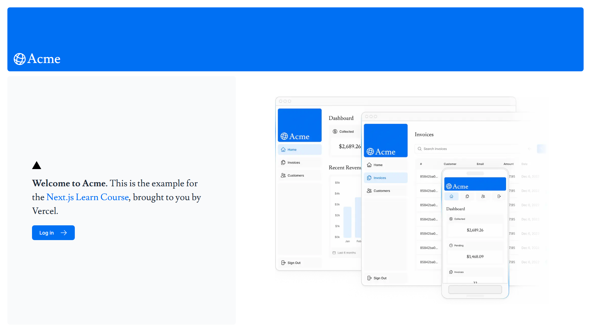
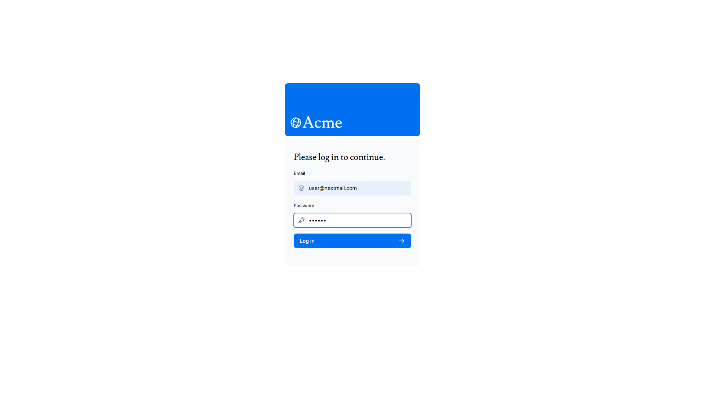
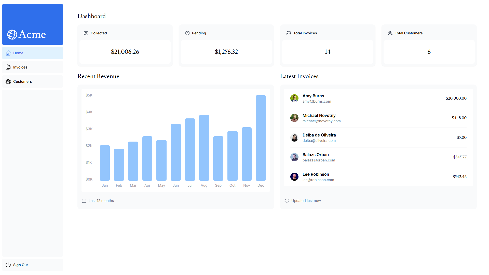
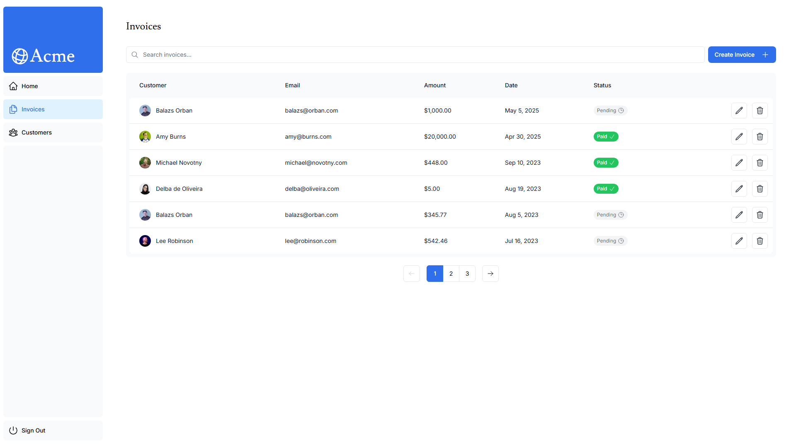
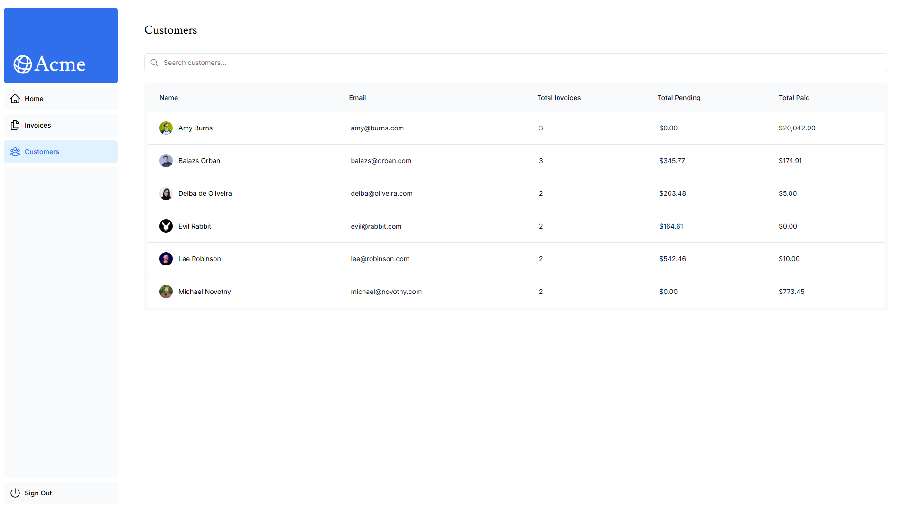

# Next.js App Router Application

A robust Next.js application featuring user authentication, dashboard access, and seamless integration with PostgreSQL.







---

## 🧰 Tech Stack

- **Framework**: [Next.js 14.2.3](https://nextjs.org/)
- **Authentication**: [NextAuth.js](https://next-auth.js.org/) with Credentials Provider
- **Database**: PostgreSQL (via [@vercel/postgres](https://vercel.com/docs/storage/vercel-postgres))
- **Styling**: Tailwind CSS

---

## 🛠️ Getting Started

### Prerequisites

- [Node.js](https://nodejs.org/) (v18 or higher)
- [pnpm](https://pnpm.io/) (v7 or higher)
- [PostgreSQL](https://www.postgresql.org/) database

### Installation

1. **Clone the Repository**
   ```
   git clone https://github.com/UtsavCK/nextjs-app.git
   cd nextjs-app
   ```
2. **Install Dependencies**

   ```
   pnpm install
   ```

3. **Create a .env file in the root directory and configure environment variables:**

   ```
   POSTGRES_URL=
   POSTGRES_URL_NON_POOLING=
   POSTGRES_USER=
   POSTGRES_HOST=
   POSTGRES_PASSWORD=
   POSTGRES_DATABASE=
   POSTGRES_URL_NO_SSL=
   POSTGRES_PRISMA_URL=

   NEXTAUTH_SECRET=
   NEXTAUTH_URL=
   DATABASE_URL=
   DATABASE_URL_UNPOOLED=

   PGHOST=
   PGHOST_UNPOOLED=
   PGUSER=
   PGDATABASE=
   PGPASSWORD=
   ```

4. **Run the Development Server**
   `    pnpm run dev
   `
   Visit http://localhost:3000 in your browser.

## 🔐 Authentication

This application uses NextAuth.js Credentials Provider for authentication.

Default Login Credentials
| Email | user@nextmail.com |
|-------|----------|
| Password | 123456 |
